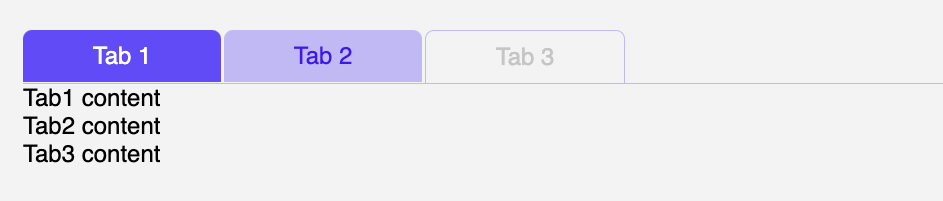

# Exercise 3 - Make use of content projection

In this exercise, we will make use of content projection in order to make the tabs component more flexible. For example, we won't have to keep track of the active index in the parent component anymore. Also, we will be able to use the tabs component in a more declarative way.

> [!IMPORTANT]
> When doing these exercises, please make sure to read the instructions carefully.

## 0. Update AppComponent template

- Go to `apps/movies/src/app/app.component.ts`
- Comment out the `app-exercise-2` component
- Uncomment the `app-exercise-3` component

Inside `Exercise3`, we will be working with the `TabGroup3` in `libs/ui/src/lib/tabs-3/tabs.component.ts`.

First, let's refactor it to use content projection! 

## 1. Refactor `TabGroup3` to use content projection (ng-content)

Todo:
- Go to `libs/ui/src/lib/tabs-3/tabs.component.ts`
- Add an `ng-content` (catch-all) tag next to the `ul` element (here, we will project the tab content)
- Wrap the `ng-content` tag in a `div` with the class `tab-content` (for styling purposes)
- Now, our component is ready to be used in a more declarative way ✨

<details>
  <summary>Solution</summary>

```html
// libs/ui/src/lib/tabs-3/tabs.component.ts

<ul class="tab-header-items">
  ...
</ul>

<div class="tab-content">
  <ng-content />
</div>
```
</details>


## 2. Update `Exercise3` template to use `TabGroup3` content projection

We want to move the @switch() block inside the `TabGroup3` component and make use of content projection.

Todo:
- Go to `apps/movies/src/app/exercise-3/exercise-3.component.ts`.
- Move the `@switch()` block inside the `TabGroup3` component.
- We are in the right direction!

> NOTE: We are still depending on the `activeIndex` property in the parent component. We will fix this in the upcoming tasks.

<details>
  <summary>Solution</summary>

```html
// apps/movies/src/app/exercise-3/exercise-3.component.ts

<ds-tab-group3
  [tabs]="tabs"
  [(activeIndex)]="activeIndex"
  [centeredTabs]="centered"
  [fullWidthTabs]="fullWidth"
>
  @switch (activeIndex) {
    @case (0) {
      <div>Tab1 content</div>
    }
    @case (1) {
      <div>Tab2 content</div>
    }
    @case (2) {
      <div>Tab3 content</div>
    }
  }
</ds-tab-group3>

```

</details>

## 3. Create a `Tab3` component which will be used to project the tab content 

Instead of using the `@switch()` block, we will create a `Tab3` component which will be used to project the tab content.
We want our `Tab3` component to have `title` and `disabled` inputs, and a `selected` field which will be used to determine whether the tab is selected or not.

We want the `Tab3` component to be used inside the `TabGroup3` component like this:

```html
<ds-tab-group3 [(activeIndex)]="activeIndex">
  <ds-tab3 title="Tab 1">
    <div>Tab1 content</div>
  </ds-tab3>
  <ds-tab3 title="Tab 2">
    <div>Tab2 content</div>
  </ds-tab3>
  <ds-tab3 title="Tab 3" disabled="true">
    <div>Tab3 content</div>
  </ds-tab3>
</ds-tab-group3>
```

As you can see we won't need to use a switch block anymore, to show the tab content. We also won't pass the `tabs` as an input to the `TabGroup3` because the `Tab3` will contain that info.

Todo:
- Create a `Tab3` component inside `libs/ui/src/lib/tabs-3` folder, name it `tab.component.ts`.
- Add a `title` input to the `Tab3` component.
- Add a `disabled` input to the `Tab3` component.
- Add a `selected` field to the `Tab3` component.
- Add a `<ng-content />` tag inside the `Tab3` template.

<details>
  <summary>Solution</summary>

```ts
// libs/ui/src/lib/tabs-3/tab.component.ts
import { booleanAttribute, Component, Input } from '@angular/core';

@Component({
  selector: 'ds-tab3',
  template: `
    <ng-content />
  `,
  standalone: true,
})
export class Tab {
  @Input() title?: string;
  @Input({ transform: booleanAttribute }) disabled = false;

  selected = false;
}
```

As you can see, we are not using the `title` inside the template because, we will be using it inside the `TabGroup3` component. 

</details>

## 4. Update `TabGroup3` component to use `Tab3` component instead of `tabs` input

We will capture the `Tab3` components inside the `TabGroup3` component using `@ContentChildren` decorator. And we will use the `Tab3` component input fields to get the `title` and `disabled` properties.

Todo:
- Go to `libs/ui/src/lib/tabs-3/tabs.component.ts`
- Remove the `tabs` input. (we will replace it with `@ContentChildren` decorator)
- Import `Tab3` component.
- Add a `@ContentChildren` decorator to capture the `Tab3` components and store them in a `tabs` field of type `QueryList<Tab3>`.
- That's it! We are ready to use the `Tab3` component inside the `TabGroup3` component.

> NOTE: Uncomment the commented out export in `libs/ui/src/lib/tabs-3/index.ts` for `Tab3` component

- Go to `apps/movies/src/app/exercise-3/exercise-3.component.ts`
- Remove the `tabs` input from the `TabGroup3` component.
- Remove the `@switch()` block from the `TabGroup3` component.
- Add the `Tab3` component in the `imports` array of the `Exercise3`.
- Pass the following template inside of it:

```html
<ds-tab3 title="Tab 1">
  <div>Tab1 content</div>
</ds-tab3>
<ds-tab3 title="Tab 2">
  <div>Tab2 content</div>
</ds-tab3>
<ds-tab3 title="Tab 3" disabled="true">
  <div>Tab3 content</div>
</ds-tab3>
```

<details>
  <summary>Solution</summary>

```diff
// libs/ui/src/lib/tabs-3/tabs.component.ts

import { ContentChildren, QueryList } from '@angular/core';
import { Tab3 } from './tab.component';

@Component({...})
export class TabGroup3 {
-  @Input() tabs: Array<{ title: string; disabled?: boolean }> = [];
+  @ContentChildren(Tab3) tabs?: QueryList<Tab3>;
}
```
  
```ts
// apps/movies/src/app/exercise-3/exercise-3.component.ts

import { TabGroup3, Tab3 } from '@ng-ds-ws/ui';

@Component({
  selector: 'app-exercise-3',
  template: `
    // removed for brevity
  
    <ds-tab-group3
      [(activeIndex)]="activeIndex"
      [centeredTabs]="centered"
      [fullWidthTabs]="fullWidth">
      <ds-tab3 title="Tab 1">
        <div>Tab1 content</div>
      </ds-tab3>
      <ds-tab3 title="Tab 2">
        <div>Tab2 content</div>
      </ds-tab3>
      <ds-tab3 title="Tab 3" disabled="true">
        <div>Tab3 content</div>
      </ds-tab3>
    </ds-tab-group3>
  `,
  imports: [TabsSettingsComponent, TabGroup3, Tab3],
})
export class Exercise3 {}
```

It should look something like this:



</details>

## 5. Update the `Tab3` component to only show the selected tab content

We will use the `selected` field of the `Tab3` component to show the selected tab content. We will use display none to hide the unselected tab content.

Todo:
- Go to `libs/ui/src/lib/tabs-3/tab.component.ts`
- Wrap the `<ng-content />` tag inside a `div`.
- Add `display: none` to the `div` tag if the `selected` field is false, otherwise, set it to `block`
- Add `attr.aria-hidden` to the `div` tag and set it to `true` if the `selected` field is false.
- By default, none of the tabs will show up, because the selected field is false by default.

<details>
  <summary>Solution</summary>

```html
 <div
  role="tabpanel"
  [style.display]="selected ? 'block' : 'none'"
  [attr.aria-hidden]="!selected">
  <!-- Needed to capture all the content of the tab -->
  <ng-content />
</div>
```

</details>

## 5. Update the `TabGroup3` component to handle the tab selection

We want to update the `selectTab` method to update each tab's `selected` field. We will also update the `ngAfterContentInit` method to set the first tab as selected by default.

Todo:
- Go to `libs/ui/src/lib/tabs-3/tabs.component.ts`
- Update the `selectTab` method to update each tab's `selected` field based on the `index` parameter, and emit only when the active index is different from the current index.
- Add the `ngAfterContentInit` method to set the selected tab based on the `activeIndex` field. (we will use the `selectTab` method)

<details>
  <summary>Solution</summary>

```ts
// libs/ui/src/lib/tabs-3/tabs.component.ts

@Component({...})
export class TabGroup3 implements AfterContentInit {
  @ContentChildren(Tab3) tabs?: QueryList<Tab3>;

  ngAfterContentInit() {
    if (this.tabs) {
      this.selectTab(this.activeIndex);
    }
  }

  selectTab(index: number) {
    this.tabs?.forEach((tab, i) => {
      tab.selected = i === index; // update each tab's selected field
    });

    if (this.activeIndex !== index) {
      this.activeIndexChange.emit(index);
    }
  }
}
```

Now, tab selection should work as expected when clicking on the tab header items. But, try to update the input above that says `Active Index`, it won't work. We will fix this in the next task.

</details>

## 6. Update the `TabGroup3` component to handle the tab selection when the `activeIndex` changes

In order to handle input changes, we will use the `ngOnChanges` lifecycle hook. When the `activeIndex` changes, we will call the `selectTab` method with the new `activeIndex` value.

Todo:
- Go to `libs/ui/src/lib/tabs-3/tabs.component.ts` 
- Add `ngOnChanges` lifecycle hook.
- Call the `selectTab` method with the new `activeIndex` value.

<details>
  <summary>Solution</summary>

```ts
ngOnChanges(changes: SimpleChanges) {
  if (changes['activeIndex'].currentValue) {
    this.selectTab(this.activeIndex);
  }
}
```

</details>
  
## BONUS - 7. Update the `TabGroup3` component to handle the tabs when they are added or removed (using `QueryList.changes`)

We want to update the `ngAfterContentInit` method to handle the tabs when they are added or removed. We will use the `QueryList.changes` observable to listen to the changes.

Todo:
- Go to `libs/ui/src/lib/tabs-3/tabs.component.ts`
- Listen to the `QueryList.changes` observable inside the `ngAfterContentInit` method.
- If there are no tabs, do nothing.
- If there are tabs, check if the selected tab is still there, if not, select the first tab.
- If the length of the tabs is greater than the active index, select the active index tab.
- If the selected tab is still there, do nothing.

<details>
  <summary>Solution</summary>

```ts
// libs/ui/src/lib/tabs-3/tabs.component.ts

import { ChangeDetectorRef, inject } from '@angular/core';

export class TabGroup3 implements AfterContentInit, OnChanges {
  private destroyRef = inject(DestroyRef);
  private cdr = inject(ChangeDetectorRef);

  ngAfterContentInit() {
    if (this.tabs) {
      // select the activeIndex by default
      this.selectTab(this.activeIndex);
      
      this.tabs.changes.pipe(takeUntilDestroyed(this.destroyRef)).subscribe((changes) => {
        const tabs = this.tabs?.toArray() || [];

        // if there are no tabs, do nothing
        if (tabs.length === 0) return;

        // check if the selected tab still exists
        const selectedTab = this.selectedTab();
        if (!selectedTab) {
          // try to select the previously selected tab index if it exists
          if (tabs.length > this.activeIndex && this.activeIndex !== null) {
            this.selectTab(this.activeIndex);
          } else {
            // select the first tab if the selected tab does not exist
            this.selectTab(0);
          }
        }
      });
    }
  }

  selectedTab() {
    return this.tabs?.find((tab) => tab.selected);
  }
}
```


Add this into `Exercise3` template:
```html
<div style="display: flex; justify-content: flex-start; gap: 5px">
  <button (click)="addTab()">Add tab</button>
  @for (tab of tabs; track $index) {
    <button (click)="removeTab($index)">
      Remove tab {{ tab.title }} - {{ $index }}
    </button>
  }
</div>

<br />

<ds-tab-group3
  [(activeIndex)]="activeIndex"
  [fullWidthTabs]="fullWidth"
  [centeredTabs]="centered">
  @for (tab of tabs; track $index) {
    <ds-tab3 [title]="tab.title">
      {{ tab.title }}
    </ds-tab3>
  }
</ds-tab-group3>
```

Add this into `Exercise3` class:
```ts
addTab() {
  this.tabs.push({
    title: 'New Tab' + (this.tabs.length + 1),
    disabled: Math.random() > 0.5,
  });
}
removeTab(index: number) {
  this.tabs.splice(index, 1);
}
```

Check the console to see the logs. You should see something like this:


Yes, an `ExpressionChangedAfterItHasBeenCheckedError` 😱.

You can fix it by wrapping everything inside `selectTab` method inside a `setTimeout` with a delay of 0 😄.

```ts
selectTab(index: number) {
  setTimeout(() => {
    this.tabs?.forEach((tab, i) => {
      tab.selected = i === index;
    });

    if (this.activeIndex !== index) {
      this.activeIndexChange.emit(index);
    }
  });
}
```

Open the console again, and you should see no errors.

Let's try to fix it in a better way. Signals 🚦!

On tab: `libs/ui/src/lib/tabs-3/tab.component.ts`
```ts
selected = signal(false);
```
```html
[style.display]="selected() ? 'block' : 'none'"
[attr.aria-hidden]="!selected()"
```

On tabgroup: `libs/ui/src/lib/tabs-3/tabs.component.ts`
```ts
selectTab(index: number) {
  this.tabs?.forEach((tab, i) => {
    tab.selected.set(i === index);
  });

  if (this.activeIndex !== index) {
    this.activeIndexChange.emit(index);
  }
} 

selectedTab() {
  return this.tabs?.find((tab) => tab.selected());
}
```

That's it! No more errors! 🎉 

</details>
